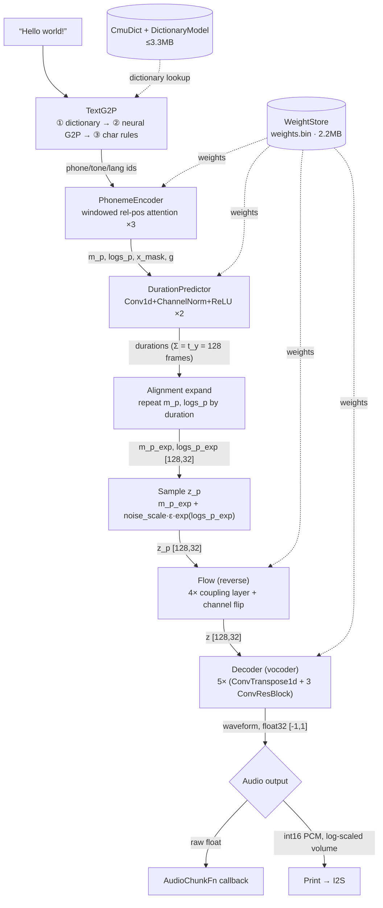

# Architecture: how TinyTTS is actually built, and why

The design decisions behind TinyTTS's four model stages -- the "why is it built this way"
detail that isn't needed to just use the library (see the top-level README for that), but
matters if you're modifying it, debugging it, or curious.

## The four stages

| Stage | Implementation | Why |
|---|---|---|
| `text_encoder` (phoneme/tone/language embeddings + transformer) | hand-written C++ (`PhonemeEncoder`, `Attention`, `TransformerBlock`) | attention-bearing, `onnx2tf` can't convert it |
| `flow` (normalizing flow, prior → posterior latent) | hand-written C++ (`Flow`) | same reason — its coupling layers use the same attention module |
| `duration_predictor` | hand-written C++ (`DurationPredictor`) | plain Conv1d/ChannelNorm/ReLU -- converts cleanly, but hand-written anyway to drop TFLite Micro's fixed-input-shape limitation entirely |
| `decoder` (HiFi-GAN-style vocoder) | hand-written C++ (`Vocoder`) | plain Conv1d/ConvTranspose1d/LeakyReLU -- same reasoning as `duration_predictor` |

All four stages are hand-written C++ -- there is no TFLite Micro, or any other
inference-runtime, dependency anywhere in this library.

`text_encoder` and `flow` both use a **windowed relative-position attention** module that
the ONNX→TFLite converter (`onnx2tf`) cannot handle (three different conversion bugs found
across three attempted PyTorch-side workarounds, none fully resolved -- see `docs/research.md`
for the specifics), so they're implemented directly as hand-written C++ instead of going
through TFLite Micro at all.

`duration_predictor` (two stacked Conv1d(kernel_size=3)+ChannelNorm+ReLU layers plus a
Conv1d(kernel_size=1) projection, with speaker conditioning added before the first conv --
`tiny_tts.models.synthesizer.DurationEstimator`) and `decoder` (Conv1d pre + 5 upsample
stages, each a LeakyReLU + ConvTranspose1d + 3 summed dilated ConvResBlocks, + LeakyReLU +
Conv1d post + tanh -- `tiny_tts.models.synthesizer.WaveformDecoder`) both convert to TFLite
cleanly on their own -- no attention, nothing `onnx2tf` struggles with. Both were moved to
hand-written C++ anyway, once the attention primitives (`Ops.h`'s `conv1d`/
`channelLayerNormInplace`/`reluInplace`, plus `convTranspose1d`/`leakyReluInplace` added for
`decoder`) already existed for `text_encoder`/`flow`, because doing so removes TFLite Micro's
fixed-input-shape limitation for these stages entirely: an utterance of any length runs
through the whole pipeline in a single pass, with no window to slide across it, no
truncation risk, and no arena-sizing/op-registration/quantization concerns for either stage.

The hand-written C++ was verified bit-exact (cosine similarity 1.000000 for every stage,
`decoder` included) against the original PyTorch model at multiple sequence lengths before
being trusted; see `research/` for the validation scripts and `test/` for the ongoing
regression harness.

## Data flow

What actually happens between `tts.speak("Hello world!")` and the samples that reach the
speaker, with the real tensor shapes and parameter values this project's own test vectors
produce. Solid arrows are the per-utterance tensor flow through the four stages above; dashed
arrows are model/dictionary data loaded once at `begin()` (from flash or PSRAM), not
recomputed per call.

`TextG2P`'s three tiers are tried in order, first match wins -- the dictionary covers most
real words, the neural GRU fallback (see "Text-to-phoneme pipeline" below) handles proper
nouns and unusual words, and character-level rules are the last resort for anything neither
covers. `WeightStore` is the one buffer backing all four model stages (see "Weights" below),
not four separate files.

## Text-to-phoneme pipeline

Text is turned into phonemes by `TextG2P`, a from-scratch port of the upstream project's
own Node.js reference pipeline (word-splitting → CMU Pronouncing Dictionary lookup →
neural G2P fallback → character-level fallback for anything else), backed by a
123,463-entry dictionary compiled into a compact binary lookup table (see `docs/research.md`
for how it's generated, and the top-level README's "Model data sizes" for the slimmed
alternative).

The neural fallback (`DictionaryModel`, `setDictionaryModel()`) is a from-scratch C++ port
of the reference project's own GRU encoder-decoder (`g2p_predict.js`/the Python `g2p_en`
package it's itself a port of) -- verified bit-exact against both before being trusted (see
`research/g2p_reference_numpy.py`, `docs/research.md`) -- for words not in the dictionary
(proper nouns, made-up words, etc.). Its four GRU weight matrices (~94% of its params) are
INT8-quantized (symmetric, per output row); the quantization was checked for accuracy loss
(a 5,000-word random sample of the dictionary scored 70.8% correct vs. the unquantized
model's 70.7%, with only 0.96% of individual predictions differing at all) before shipping
it, not assumed safe.

## Weights (`weights.bin`)

Every hand-written stage's weights -- `PhonemeEncoder`/`Flow`/`DurationPredictor`/`Vocoder`
-- live in one buffer, `weights.bin` (`setWeights()`), extracted directly from the upstream
PyTorch checkpoint by `research/export_weights_and_vectors.py` -- none of them are exported
via ONNX or any conversion pipeline, since none of the four stages needs one anymore.
Stored float16 (halves size for a rounding-error-level precision cost -- confirmed via the
same cosine-similarity checks used elsewhere, `WeightStore.h` expands each value to float32
at parse time so no consuming code needs to care), with two tensors dropped entirely:
`bert_proj`/`ja_bert_proj`'s weight matrices reduce to a constant, since multi-lingual BERT
conditioning is disabled by default (`bert`/`ja_bert` are always a zero tensor, and a
`Conv1d(kernel_size=1)`'s output with a zero input is just its bias term) -- only their
small bias vectors are still needed (see `PhonemeEncoder.h`'s `forward()` doc).
